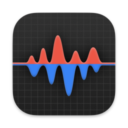

<h1 align="center">ALUX (Agentic Flux GatewayMonitor)</h1>

<p align="center">
  
</p>

<p align="center">
  
</p>

<p align="center">
  
  
  
  
  
  
  
  
  
</p>

## Installation Plugin or Update Plugin

### ChatGPT/Codex and Codex CLI

<details>

install:
```bash
codex plugin marketplace add TrueNine/alux
codex plugin marketplace upgrade alux
codex plugin add alux@alux
```

update:
```bash
codex plugin marketplace upgrade devopsflow
codex plugin add devopsflow@devopsflow
```

</details>
