# Mermaid Diagram Authoring

这是在 Markdown 中绘图时的首选 skill. 需要在 Markdown 中 create, 修改 or 维护任何图表时, 优先使用此 skill; 即使 user 没有明确提及 Mermaid, 也应先评估 Mermaid 是否适用. 必须交付可渲染, 可维护的 Mermaid 源 code, 而不是截图.

## Official Mermaid Documentation

以 Mermaid 官方文档为准:

- [Mermaid documentation home](https://mermaid.js.org/)
- [Diagram syntax index](https://mermaid.js.org/syntax/)
- [Configuration reference](https://mermaid.js.org/config/configuration.html)
- [Accessibility reference](https://mermaid.js.org/config/accessibility.html)
- [Live Editor](https://mermaid.live/)
- [Mermaid GitHub repository](https://github.com/mermaid-js/mermaid)

下文每个种图都提供官方文档链接 and 最小, 可改造的 example. 使用前先确认 target Markdown renderer 支持所选图 type 及当前 Mermaid 版本.

## When To Use

- **Markdown diagram work:**在 Markdown 中新建, 修改, 补充 or refactor 图表时, 优先使用 this skill.
- user 明确要求 Mermaid, 图表源 code, 流程图, 时序图, 架构图, 状态图, ER 图 or repository 结构时使用.
- 需要表达 code 流, API 交互, 依赖关系, 数据管道, 生命周期, project 计划, 指标 or directory 结构时使用.
- file and directory 结构必须使用 Mermaid `treeView-beta` and Material Icon Theme 图标; 不要以 plain-text or ASCII tree 作为主要表示形式.

## Diagram Catalog and Examples

每张图只表达 1 个主要关系 or 流程. example 中的标识符使用稳定的英文, 显示文本可使用 project work language.

### Flowchart

适用于 workflow, 决策树, 请求流 and 依赖流. 官方文档:[Flowcharts](https://mermaid.js.org/syntax/flowchart.html).

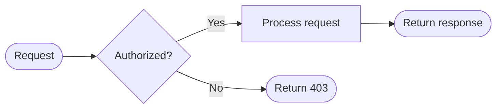

### Sequence Diagram

适用于按时间顺序展示 participant, service or API 的交互. 官方文档:[Sequence diagrams](https://mermaid.js.org/syntax/sequenceDiagram.html).

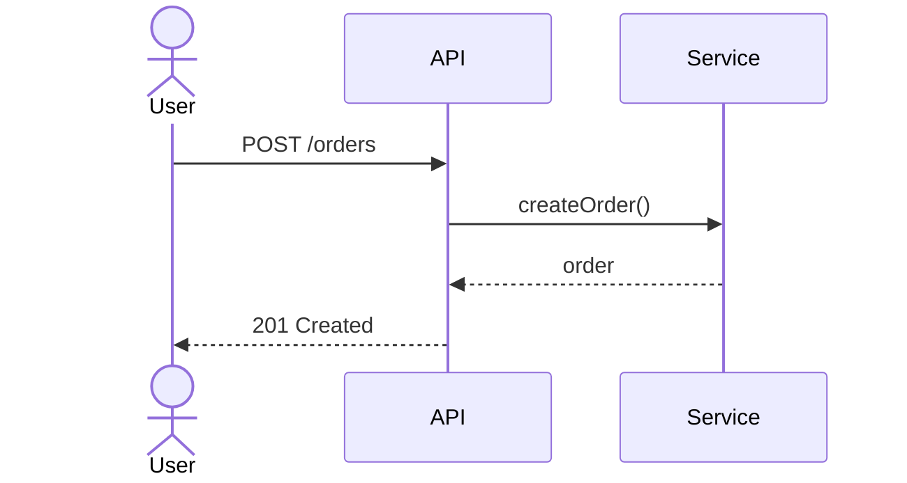

### Class Diagram

适用于 type, 成员 and 继承/implementation 关系本身是图表重点的场景. 官方文档:[Class diagrams](https://mermaid.js.org/syntax/classDiagram.html).

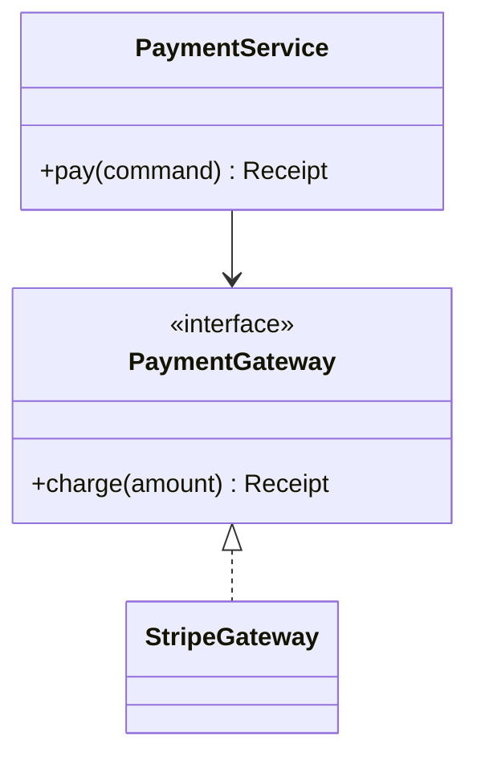

### State Diagram

适用于生命周期状态 and 状态转换. 官方文档:[State diagrams](https://mermaid.js.org/syntax/stateDiagram.html).

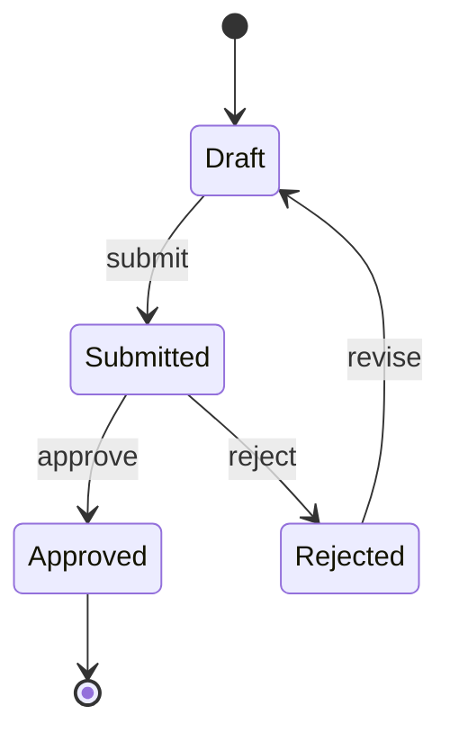

### Entity Relationship Diagram

适用于数据库 eneity 及其基数关系. 官方文档:[Entity Relationship diagrams](https://mermaid.js.org/syntax/entityRelationshipDiagram.html).

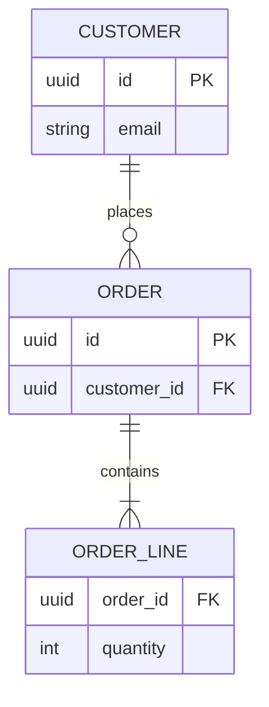

### User Journey

适用于从 user 视角表达步骤, 角色 and 体验评分. 官方文档:[User journeys](https://mermaid.js.org/syntax/userJourney.html).

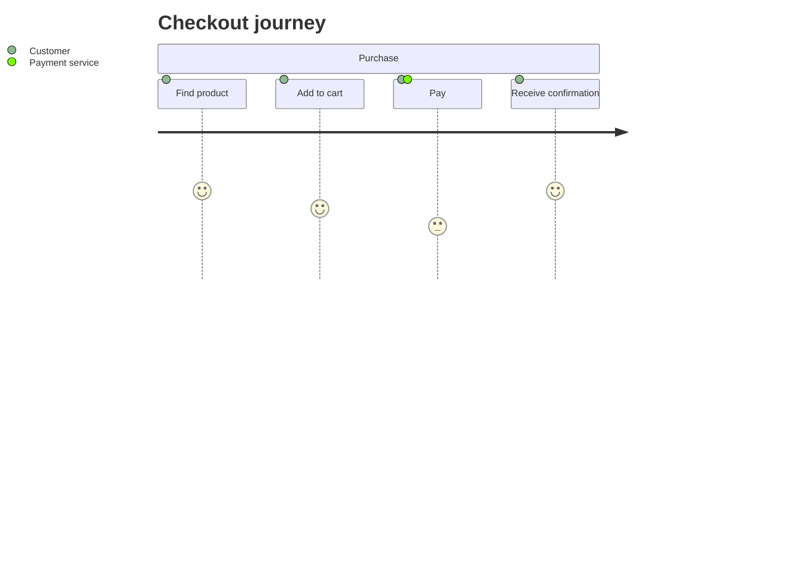

### Gantt Chart

适用于有日期, 持续时间, 依赖关系 and 里程碑的计划. 官方文档:[Gantt diagrams](https://mermaid.js.org/syntax/gantt.html).

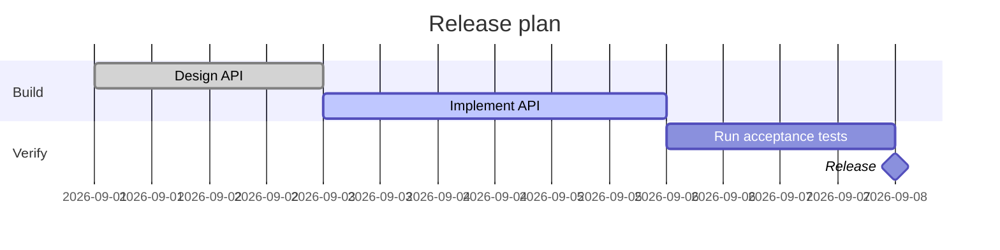

### Pie Chart

适用于展示整体中的比例; 类别较多时改用柱状图 or XY chart. 官方文档:[Pie charts](https://mermaid.js.org/syntax/pie.html).

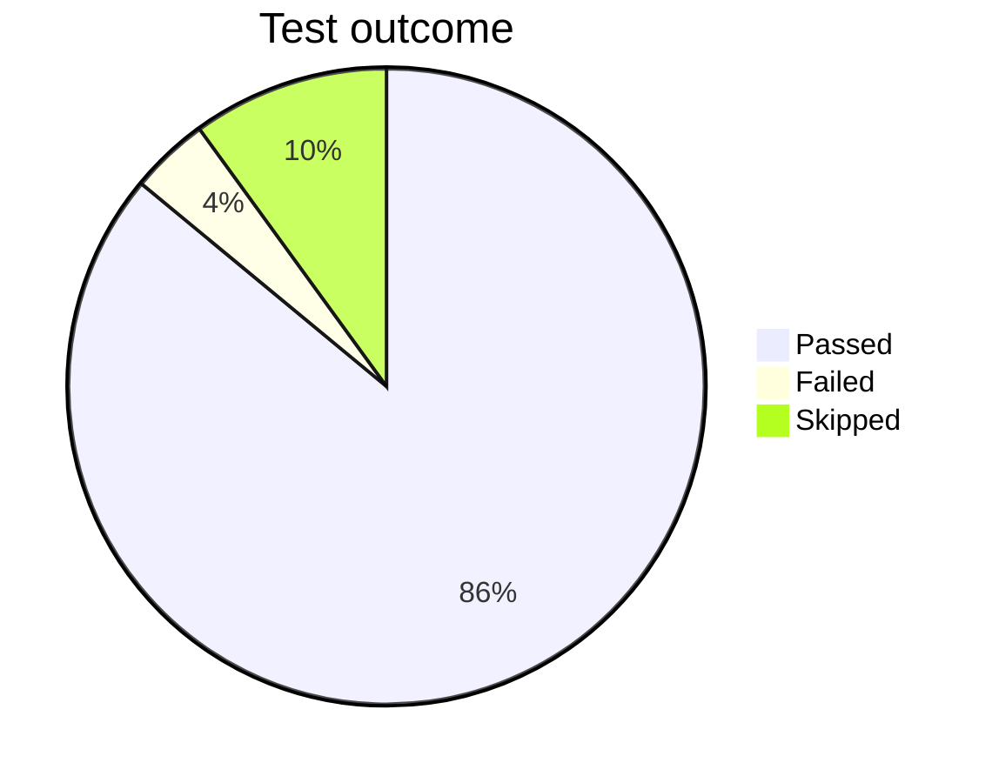

### Quadrant Chart

适用于在两个维度上比较选项 or 优先级. 官方文档:[Quadrant charts](https://mermaid.js.org/syntax/quadrantChart.html).

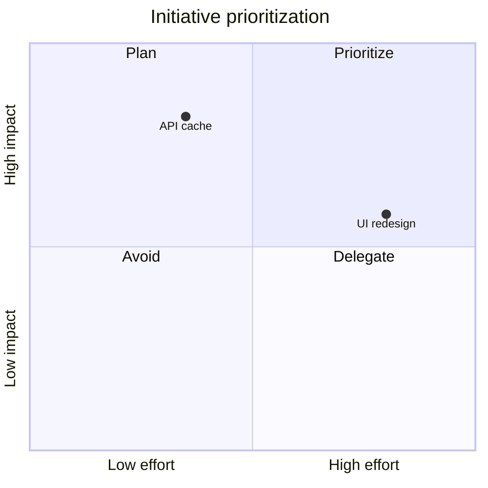

### Requirement Diagram

适用于需求, 风险, 验证 and 追踪关系. 官方文档:[Requirement diagrams](https://mermaid.js.org/syntax/requirementDiagram.html).

```mermaid
requirementDiagram
    requirement authentication {
      id: REQ-1
      text: Users must authenticate before checkout.
      risk: high
      verifymethod: test
    }
    functionalRequirement login {
      text: The API validates an access token.
      risk: medium
      verifymethod: test
    }
    authentication - contains -> login
```

### Gitgraph

适用于分支, 提交, 合并 and 发布 history. 官方文档:[Gitgraph diagrams](https://mermaid.js.org/syntax/gitgraph.html).

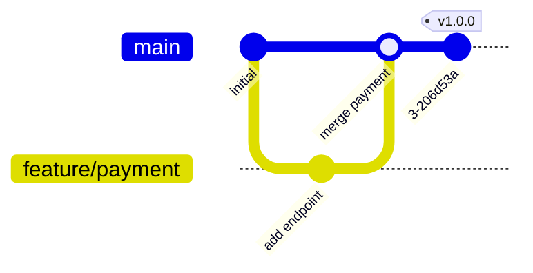

### C4 Diagram

适用于 C4 模型的 system context, 容器, 组件 or code 层级. 官方文档:[C4 diagrams](https://mermaid.js.org/syntax/c4.html).

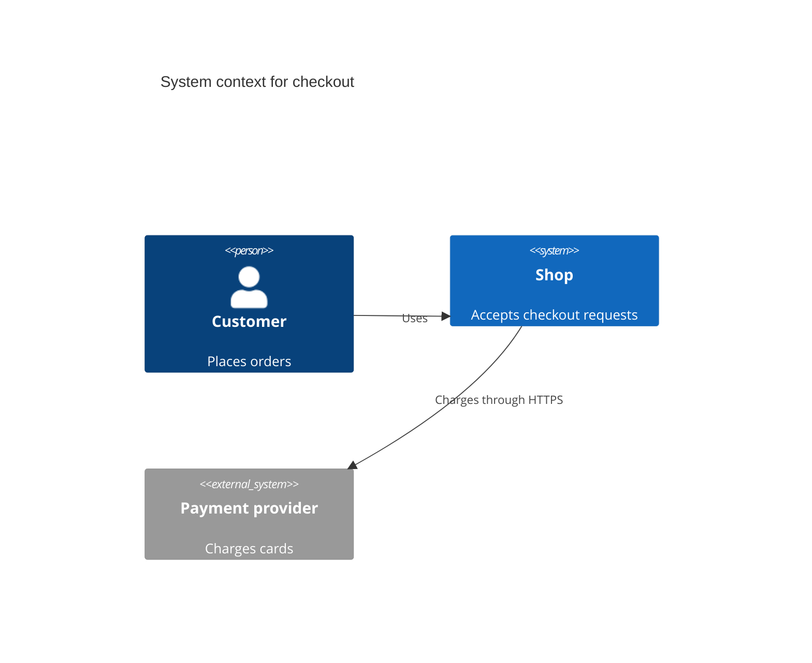

### Mindmap

适用于从中心主题发散的概念层级; 不用于具有严格 execution 顺序的 workflow. 官方文档:[Mindmaps](https://mermaid.js.org/syntax/mindmap.html).

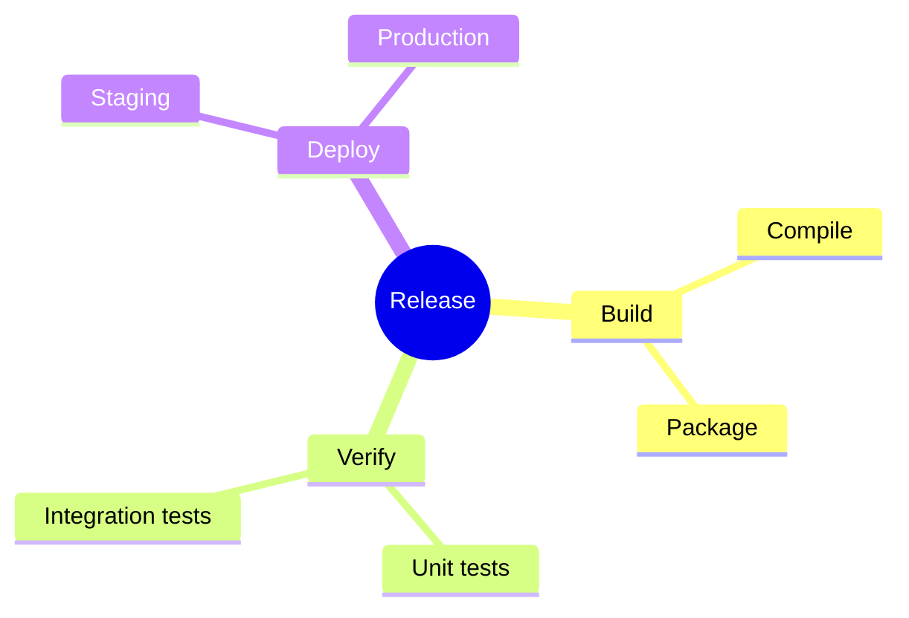

### Timeline

适用于按时间段呈现 event 而非 task 工期. 官方文档:[Timelines](https://mermaid.js.org/syntax/timeline.html).

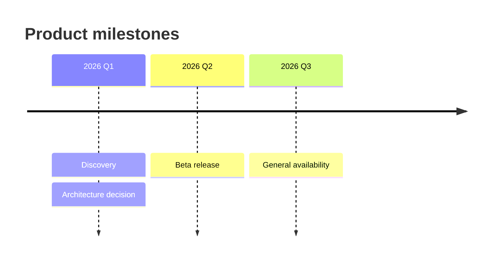

### ZenUML Sequence Diagram

适用于需要方法 call 语义的紧凑时序图. 官方文档:[ZenUML](https://mermaid.js.org/syntax/zenuml.html).

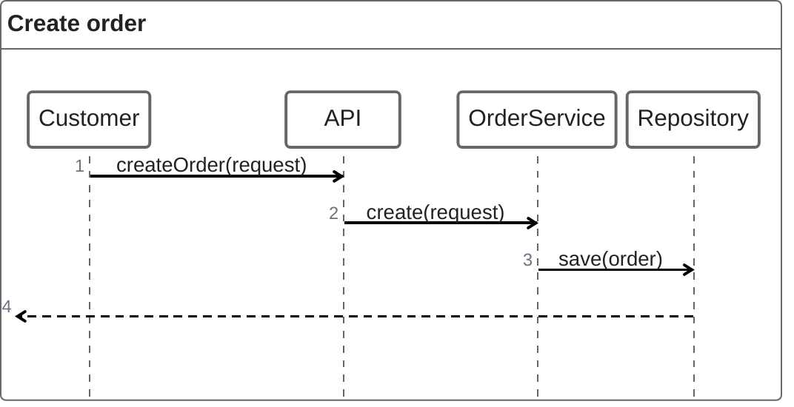

### Sankey Diagram

适用于展示从来源到 target 的数量流动. 官方文档:[Sankey diagrams](https://mermaid.js.org/syntax/sankey.html).

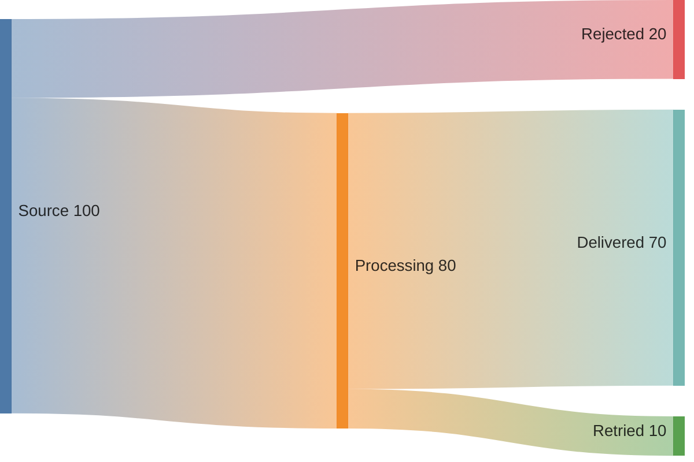

### XY Chart

适用于比较 category 数据 or 展示 single 数 value 序列. 官方文档:[XY charts](https://mermaid.js.org/syntax/xyChart.html).

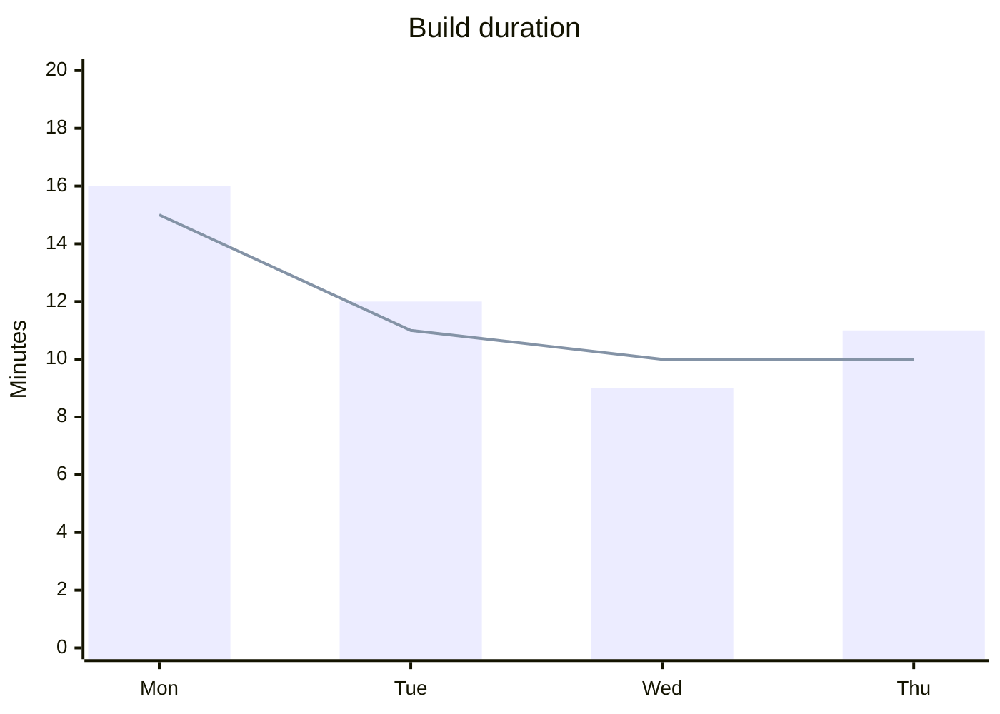

### Block Diagram

适用于无箭头, 以空间布局为主的组件概览. 官方文档:[Block diagrams](https://mermaid.js.org/syntax/block.html).

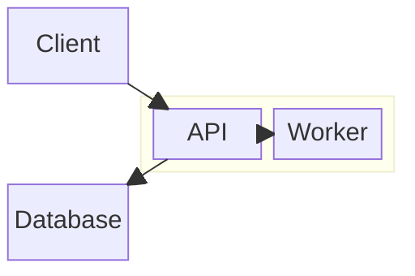

### Packet Diagram

适用于网络 protocol or 消息载荷字段布局. 官方文档:[Packet diagrams](https://mermaid.js.org/syntax/packet.html).

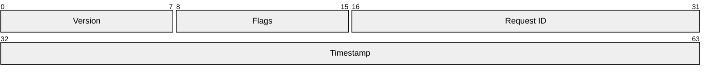

### Kanban Board

适用于 work 项在不同阶段间的可视化管理. 官方文档:[Kanban diagrams](https://mermaid.js.org/syntax/kanban.html).

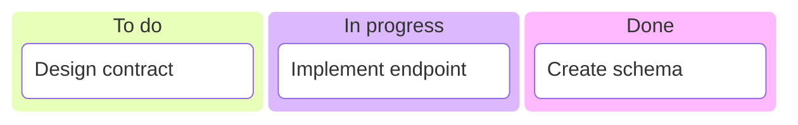

### Architecture Diagram

适用于展示 service, 基础设施 and 它们的连接端口. 官方文档:[Architecture diagrams](https://mermaid.js.org/syntax/architecture.html).

```mermaid
architecture-beta
    group cloud(cloud)[Cloud]
    service client(internet)[Client]
    service api(server)[API] in cloud
    service db(database)[Database] in cloud
    client:R --> L:api
    api:R --> L:db
```

### Radar Chart

适用于在相同量表上比较多个维度的 1 个 or 多个系列. 官方文档:[Radar charts](https://mermaid.js.org/syntax/radar.html).

```mermaid
radar-beta
    title Service quality
    axis Reliability, Performance, Security, Maintainability
    curve Current [8, 7, 9, 6]
    curve Target [9, 8, 9, 8]
```

### Treemap

适用于以嵌套矩形展示层级中的相对大小. 官方文档:[Treemaps](https://mermaid.js.org/syntax/treemap.html).

```mermaid
treemap-beta
    "Services"
        "API": 60
        "Worker": 25
        "Scheduler": 15
```

### TreeView

仅用于 file and directory 结构. 使用 `treeView-beta`, directory 名以 `/` 结尾, 每个节点都必须显式指定 Material Icon Theme 图标. TreeView 是实验性语法; 请先在 target renderer 中验证. 相关资料:[Diagram syntax index](https://mermaid.js.org/syntax/) and [Iconify Material Icon Theme](https://icon-sets.iconify.design/material-icon-theme/).

```mermaid
---
config:
  treeView:
    showIcons: true
    defaultIconPack: material-icon-theme
---
treeView-beta
    project/ icon(material-icon-theme:folder)
        src/ icon(material-icon-theme:folder-src)
            main.ts icon(material-icon-theme:typescript)
        package.json icon(material-icon-theme:json)
        README.md icon(material-icon-theme:markdown)
```

更多 TreeView example 见 [file-directory-treeview.md](../alux-agent-instructions/examples/file-directory-treeview.md).

## Register Material Icon Theme

Mermaid 不会内置第3方图标 package. 渲染 include 图标的 TreeView 前, 必须先注册 Material Icon Theme.

使用 npm package and bundler:

```bash
npm install @iconify-json/material-icon-theme
```

```js
import mermaid from 'mermaid';
import { icons } from '@iconify-json/material-icon-theme';

mermaid.registerIconPacks([
  {
    name: 'material-icon-theme',
    icons,
  },
]);
```

使用 CDN 延迟加载:

```js
import mermaid from 'mermaid';

mermaid.registerIconPacks([
  {
    name: 'material-icon-theme',
    loader: async () =>
      fetch('https://unpkg.com/@iconify-json/material-icon-theme@1/icons.json')
        .then((response) => response.json()),
  },
]);
```

## Authoring Workflow

1. 明确图表的受众, 范围 and unique 目的.
2. 选择最小适用的图表 type; 不要把多个无关关注点混在相同张图中.
3. 先列出节点, participant, 状态 or eneity, 再 write 边 and 标签.
4. 保持箭头方向, 嵌套, 分组 and 命名 consistent; 管道 and 架构通常使用 `LR`, 层级通常使用 `TD`.
5. 用 `subgraph` 表示边界, 所有权 or 部署层; 避免过长边标签, 交叉连线 and 不必要的样式.
6. TreeView 先注册图标 package, 再 write 图, 并确认每个节点都有显式图标.
7. 在 target Markdown renderer 中渲染 or run 语法 verify; fix 所有解析错误后再交付.

## Validation

- 确认图表 type, 缩进, 标识符, 边 and comment 可以解析.
- 确认 target renderer 所用 Mermaid 版本支持该语法, 尤其是带 `-beta` 后缀的图表.
- 对 TreeView, 确认已注册 `material-icon-theme`, enable `showIcons`, 且每个 file and directory 节点都带 `icon(...)`.
- target renderer 不支持某项 Mermaid 语法时, 明确报告兼容性限制; 不要悄悄降级为 ASCII tree or 截图.

<!-- DF_DOC_MERMAID_SKILL_EOF: This is the complete AluxDocMermaid skill. -->
